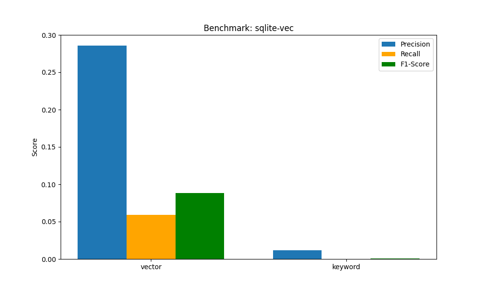

# Benchmarking Retrievel through different search modes and Vector DBs
This benchamark uses the [CISI dataset](https://www.kaggle.com/datasets/dmaso01dsta/cisi-a-dataset-for-information-retrieval/code) for testing Llama Stacks retrieval capabilities with different Vector DB providers and search modes.

## Usage
Run the script with:
```
# Default usage benchmarks sqlite-vec db and vector search mode
python benchmark_cisi.py 

# Passing arguments for vector db provider and search modes to benchmark
python benchmark_cisi.py --vector_db_id "sqlite-vec" --search-modes "vector" "keyword"
```

## Charts

### Histograms


### Radar

### Bar
